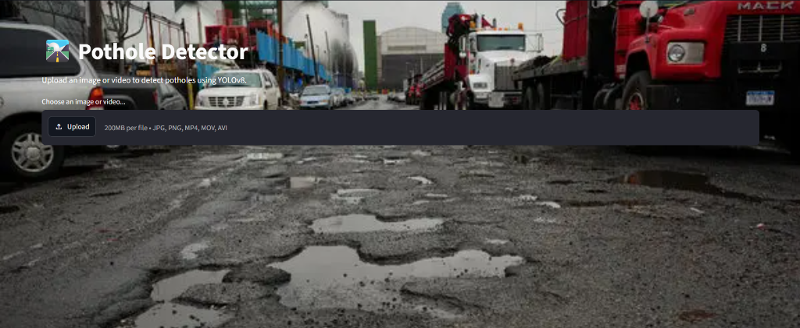

# Pathole Detector (Road Damage Detection System)

## Overview of the Project
The Pathole Detector is an AI-powered computer vision web application designed to automatically identify and classify road damage. Using a custom-trained YOLOv8 deep learning model trained on a massive 10GB dataset (32,000+ images), this system detects potholes and various cracks in both images and videos. It also calculates the severity of the damage to help prioritize road maintenance.

## Features
- **YOLOv8 Object Detection:** High-speed, highly accurate detection of 4 classes (Longitudinal Cracks, Transverse Cracks, Alligator Cracks, Potholes).
- **Image & Video Support:** Seamlessly process static images or parse video files frame-by-frame.
- **Severity Estimation Logic:** Calculates whether a pothole is Low, Medium, or High severity based on its spatial footprint.
- **Interactive UI:** A beautiful, responsive web interface built with Streamlit.

## Technologies / Tools Used
- **Python 3.9+** (Core programming language)
- **Ultralytics YOLOv8** (Deep Learning framework for Object Detection)
- **Streamlit** (Web application framework)
- **OpenCV & Pillow** (Image and video processing)
- **Google Colab** (Used for cloud GPU training)

## Steps to Install & Run the Project

1. **Clone the repository:**
   ```bash
   git clone https://github.com/agnish-dev/Pathole-Detector.git
   cd Pathole-Detector
   ```

2. **Create a virtual environment (Recommended):**
   ```bash
   python -m venv venv
   source venv/bin/activate  # On Windows use: venv\Scripts\activate
   ```

3. **Install the dependencies:**
   ```bash
   pip install -r requirements.txt
   ```

4. **Run the Streamlit Web App:**
   ```bash
   streamlit run app.py
   ```
   *The app will automatically open in your browser at `http://localhost:8501`.*

## Instructions for Testing
To verify the system is working correctly, a unit testing suite has been provided. 
Simply run the following command in your terminal to execute the tests:
```bash
python -m unittest test_app.py
```
This will check if all necessary model weights and configuration files are present and functional.

## Screenshots


